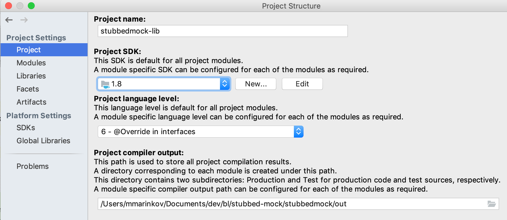
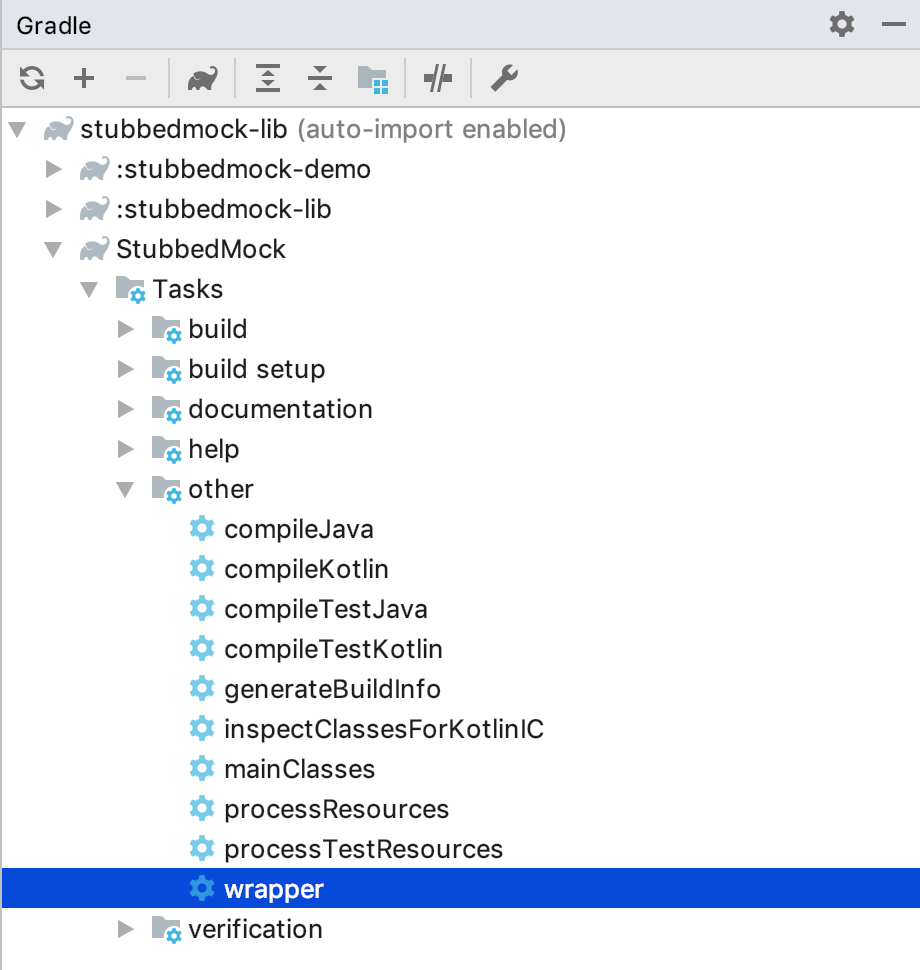
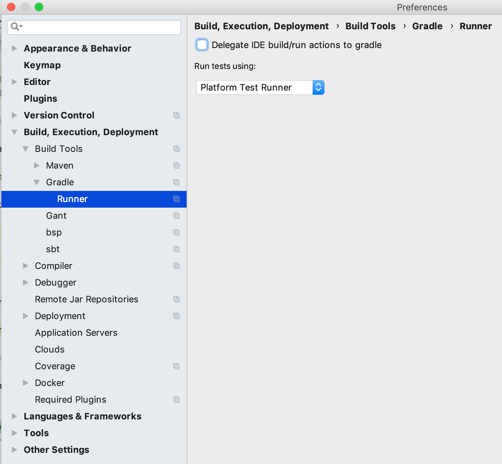

# Contributing guidelines

First of all, don't be afraid of contributing. Every contribution has value, and we
really appreciate external people helping out. In case you are unsure about anything
related to your contribution, we'll be there every step of the way to help. Let's
do this together.

#### Table of contents

- [Code of Conduct](#code-of-conduct)
- [Issues, requests and questions](#issues-requests-and-questions)
    + [Creating issues](#creating-issues)
    + [Branching strategy](#branching-strategy)
- [Setting up your environment](#setting-up-your-environment)
    + [Importing the project](#importing-the-project)
    + [Configuring SDK](#configuring-sdk)
    + [Gradle wrapper](#gradle-wrapper)
    + [Delegating build to Gradle (optional)](#delegating-build-to-gradle-optional)
    + [Code style and guidelines](#code-style-and-guidelines)
- [How to edit, run and test](#how-to-edit-run-and-test)
    + [Clean code](#clean-code)
    + [Modules and build configuration](#modules-and-build-configuration)
    + [Project versioning](#project-versioning)
    + [Compiling and testing](#compiling-and-testing)

## Code of Conduct

Let's start with this guideline about nice behavior. We follow our 
[Code of Conduct](CODE_OF_CONDUCT.md) located in this repository.

Check it out before you proceed.

## Issues, requests and questions

#### Creating issues

To create a new issue, request or ask a question, you can use the issues tab or
simply [click here][1].

After you have created the issue, one of the maintainers will take a look at it,
and we'll try to respond to your report in a timely manner. We like receiving any
feedback, but please check if a similar report already exists before submitting yours.

We also like getting help and working with external developers. If you want to work
on an issue, we would like to plan that work. Please make sure that you have tagged
one of the project maintainers in the comments section of the issue you are interested
in working on, and we can create a work plan together.

#### Branching strategy

Our main/default branch is `master`. It is push-protected and you cannot push any
changes to it without them being reviewed and checked first. In most cases, static
checks, tests and peer reviews will happen only after you have shown us **all** of
your work. Work-in-progress stuff needs to be marked as `[WIP]`, but you can also use
GitHub's _"draft"_ mode.

Please note that most contributors don't have `write` access to this repository at
first, so the recommended workflow to get you started would look like this:

1. [Fork][2] the repository to your private GitHub space
1. Apply your changes and move them to your repository's `master` branch. Commit messages
should not be longer than 80 characters. Also, make sure that all of them are clear
and understandable, and that commits are grouping changes logically
1. You can open a PR (pull request) from the repository's *Pull Requests* tab as soon as
you want to (i.e. you want to run checks), just make sure you put the `[WIP]` prefix in 
the PR title. Point your `master` branch to the original repository's `master` branch. 
We want to have evey PR linked directly to a project issue, so please reference the issue 
you are working on in your PR's description using the `#` notation
1. Static checks and tests are now executed on your PR before merging to `master`
1. Once your work is done and you have no more changes, remove the `[WIP]` prefix from the
PR title, and tag a maintainer in the comments section. We'll then assign a reviewer 
(or two) so that we can discuss merging the PR into our `master` branch. Make sure you 
have rebased the PR to the latest original `master` branch before asking for a review
1. In case we request changes to your work, your new commits should start with `[Review]`
1. After merging to `master`, the checks will run again, and (if successful) the new
binaries will automatically be deployed from this upstream to the relevant cloud servers
1. At this point, you can safely delete your private downstream repository

In case you have `write` access to this repository, you are already familiar with our 
workflow, and the process is very similar:

1. Create a new (logically named) branch based on `master`
1. Apply your changes to the new branch
1. You need a new PR for your changes, pointing to `master` and referencing the issue
1. Static checks and tests are executed on your branch along the way
1. When done, remove the `[WIP]` PR prefix, and tag a maintainer in the comments. Make
sure you have rebased to `master` before asking for a review
1. In case we request changes to your work, your new commits should start with `[Review]`
1. After merging to `master` and automatic checks verify the merge, new binaries are
deployed to the relevant cloud servers
1. At this point, you can safely delete your branch

## Setting up your environment

To develop this project, we used [IntelliJ IDEA](https://www.jetbrains.com/idea/) from
JetBrains. It's a fully-featured standalone desktop IDE that supports most modern
languages and build script configurations out of the box, and (especially appealing to
us) it has a free community edition for all of us open-source enthusiasts.

Our main build tool for this project is [Gradle](https://gradle.org/).

#### Importing the project

The first step towards contributing is to make sure you can edit the source code using
IntelliJ IDEA. To do this, you can choose one of the two ways:

- Use the built-in "new project from git" feature in the `File` menu of your IDE
- Clone this repository manually, then open it in the IDE from the `File` menu

After opening the project, your IDE might ask you to import the Gradle project and all 
of its modules. To do this, look out for the alert box on the bottom right of the IDE.
Remember: opening is not the same as importing. Opening shows all the files available
in the project, but importing it allows for build script integration with the IDE and
enables other tooling and development features.

After importing, you will get a dialog asking for configuration options. Choose to run
the project using the provided Gradle wrapper - this ensures that all of use use the
same version of Gradle for assembling and packaging. You can also tick the "auto-import"
checkbox to automatically import the dependencies and sub-modules, if any.

#### Configuring SDK

When done, your IDE should change the user interface to reflect that you are now working
on a Gradle project, and Gradle panel should become available in one of the sidebars.
In some cases, you might be warned that you're missing the SDK configuration. Since we
don't force a specific _compile_ version for Kotlin or Java, you can choose your own SDK
version in the project/module settings. We do, however, force the output bytecode version
to **1.6**, primarily to maintain backwards compatibility with external projects. 

The project/module settings screen should looks like this:



You might need to restart your IDE for this change to take effect.

#### Gradle wrapper

In some rare cases, due to IDE configuration or import strategy, your local Gradle wrapper
may be missing. To fix this problem, you should create a local wrapper by running the
`wrapper` task from the Gradle side panel. You can simply double click the task as shown:



#### Delegating build to Gradle (optional)

Since IntelliJ IDEA uses its own build system, and doesn't run any of the pre-defined
Gradle tasks, sometimes (although rarely) you might have missing build outputs or 
inconsistencies between the source and the output. If this happens, we have verified
that you can safely delegate all build tasks to Gradle by changing the Project
Preferences, like this:



We expect that your import ran smoothly, and that you can now enjoy coding with us. 😊

#### Code style and guidelines

We follow our own [JVM Source Guidelines](https://github.com/blacklane/jvm-source-guidelines).

## How to edit, run and test

#### Clean code

As mentioned before, we like getting feedback and external contributions. But, similarly
to our core service - professional ground transportation - we care about quality very
much. Before submitting your changes for review, please make sure you follow the rules
of "clean coding", like
(Clean Code)[https://www.google.com/search?q=robert+martin+clean+code] or
(SOLID)[https://en.wikipedia.org/wiki/SOLID] principles from Robert C. Martin.

#### Modules and build configuration

This project has two named Gradle modules, `stubbedmock-demo` and `stubbedmock-lib`,
they reside in `demo` and `stubbedmock` directories, respectively. The library source is
in `stubbedmock-lib`, and the most common usage examples are in `stubbedmock-demo`.

Each of the modules has its own Gradle configuration file (`build.gradle`), but there
is also another configuration file in the root directory that is applied to both modules.
In that root `build.gradle`, we specified all variable dependencies that we use across
both modules using a top-level `ext` block.

This project uses the standard
[Gradle directory structure](https://docs.gradle.org/current/userguide/organizing_gradle_projects.html).

#### Project versioning

When making changes, you also need to increase the project version. One of the places to
do this is in the root `build.gradle`, in `ext.projectVersion`. The other place is in the
`README.md` file (if we specified an explicit version). 

When coming up with new versions, we use (semantic versioning)[https://semver.org].
In shortest terms, for new versions we increase the `minor` number. In case of a breaking
change we increase the `major` number, and in case of an emergency quick-fix we increase
the `patch` number. If you are not sure, ask one of the maintainers what to do. 

#### Compiling and testing

**StubbedMock** is a library used only in Unit tests, so there is no actual code to "run" or
"execute" in your terminal, and there is no user interface.

You can check if your code is working by writing Unit tests for the library. To run tests,
you can use your IDE: right-click on the test directory and select the "Run all tests"
option. To run the tests from the command line, you can use the standard `test` task
(notice that we use the Gradle wrapper, `gradlew`):

```shell
$ ./gradlew test
```

In case you want to build the project from the command line, you can use the standard
`assemble` task, like so:

```shell
$ ./gradlew assemble
```
 
When dealing with cached tasks using Gradle, sometimes you just want to clear the caches
and re-build everything. This is achieved using the standard `clean` task, like so:

```shell
$ ./gradlew clean
```

You can also combine tasks together, e.g. clean, build and test the whole project:

```shell
$ ./gradlew clean assemble test
```

[1]: https://github.com/blacklane/stubbed-mock/issues/new/choose
[2]: https://github.com/blacklane/stubbed-mock/fork